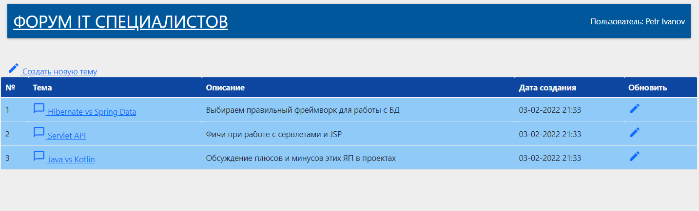
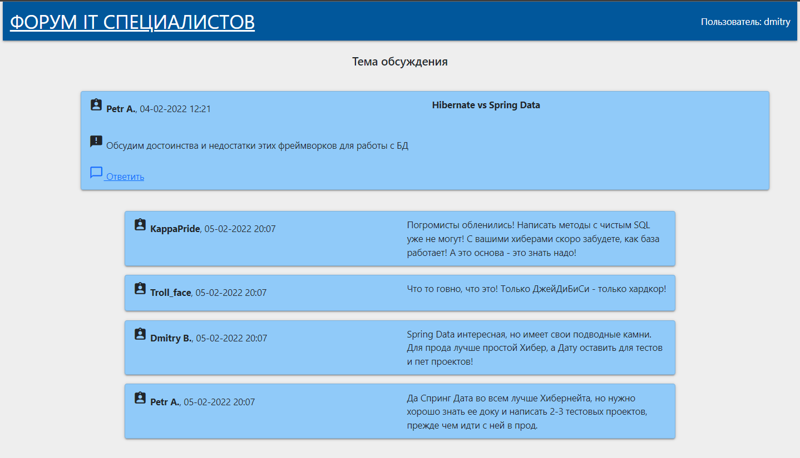
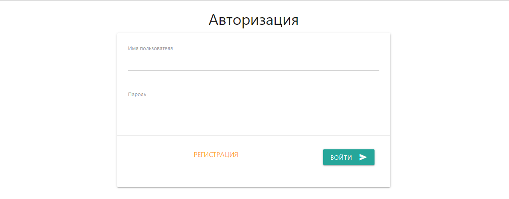
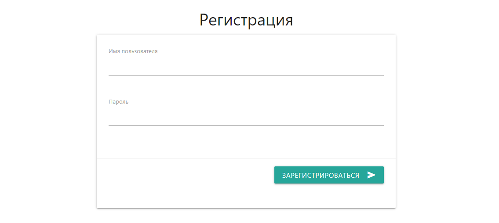

# job4j_todo
Проект "Форум" [job4j](https://job4j.ru/).

### Этот проект представляет веб приложение форума для создания и обсуждения различных тем.
Проект предназначен для знакомства со Spring Boot.

Представляет собой простую реализацию форума. Каждый полльзователь может добавлять новые темы на форуме,
редактировать их и оставлять комментарии в своих и чужих темах. Естественно не обошлось без авторизации/регистрации.

#### Функциональность:

- CRUD операции для постов на форуме

- Веб интерфейс

#### Используемые технологии:

- Spring Data JPA

- Spring Boot(Data, Security, Test), JSP, JSTL

- PostgreSQL

#### Основная страница с темами форума

#### Страница конкретного топика с комментариями к конкретному топику

#### Авторизация пользователя

#### Регистрация пользователя
